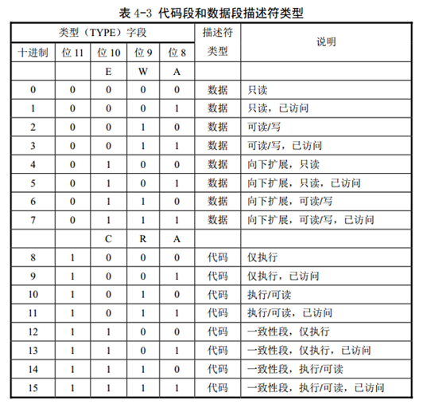

# 开发操作系统漫游


## 目录
- [环境准备](#环境准备)
    1. [linux系统](#linux操作系统)
    2. [gcc/g++](#gcc/g++)
    3. [qemu](#qemu)
    4. [nasm](#nasm)
- [前置知识](#前置知识)
    1. [浅谈](#浅谈)
    2. [linux下常用的命令](#linux下常用的命令)
    3. [gcc编译过程中发生了什么？](#gcc编译过程中发生了什么?)
    4. [关于汇编](#关于汇编)
    5. [make与Makefile](#make与Makefile)
    6. [gdb调试技能](#gdb调试技能)
    7. [磁盘基础知识介绍](#磁盘基础介绍)
- [从机器启动到操作系统的启动](#从机器启动到操作系统的启动)
    1. [浅谈i386的实模式与保护模式](#浅谈i386的实模式与保护模式)
    2. [bios与分区](#bios与分区)
    3. [bootloader的加载](#bootloader的加载)
    4. [内核的加载](#内核的加载)


## 环境准备

### linux操作系统

linux操作系统对于CS是绕不过去的一环,非常推荐大家使用,甚至是作为主力系统使用！
如果不会安装linux系统,那正好是一个动手学习的机会.在使用linux的过程中,或许会让你留下痛苦的回忆,但它们都会化为财富.
以下的示例全部使用ubuntu16.04为例.

### gcc/g++

gcc(**GNU Compiler Collection**) 是gnu开发的编程语言编译器,现在可以处理多种编程语言.我们需要它来完成对C语言以及部分汇编的编译工作.
ubuntu16.04是自带gcc的,版本为5.4.0
使用以下命令查看版本：
```shell
gcc --version
```

### qemu
qemu是一个开源仿真器,用于模拟一台计算机,可以用来运行我们编写的操作系统
使用以下命令进行安装：
```shell
sudo apt-get install qemu
```

### nasm
nasm为一种汇编器,用来编译汇编代码.
gcc自带的as对初学者可能更难一些.

## 前置知识

### 浅谈
操作系统可能是CS里最具有挑战性的一门课程了,在这门课程真的写一个操作系统还是非常困难的,但总是写一些东西总还是可以的.写这个东西一是为了在总结中进步,二是以后说不定也可以给别人做参考.
本次环境的选用在一定程度上参考了清华学堂在线课程的配置,也作出了一些变化
- 开发环境为：qemu+make+gcc+nasm+ubuntu16.04.
- 面向intel-i386开发,汇编使用intel格式

要完成一个操作系统,需要关注的知识点太多了.鉴于篇幅,个人的精力与能力,很多知识都只能简单的点一下.而且也是在一边学习一边写.


### linux下常用的命令
我们对操作系统的控制的方式有两种,一种是常用的GUI式的（图形化界面）,另外一种是CLI（命令行）.一般我们将输入命令的地方称作shell,Terminal,终端,命令提示符.
无论是在windows下,或者linux,乃至OS X都是有命令行的,不过在具体的命令下有些差别的.这里只介绍最常用/必须要用到的命令.


```shell
ls      展示当前目录下的文件与目录
ls -a   展示所有文件（包括隐藏文件/文件夹)
ls -l   展示更详细的信息
```
```shell
cp  复制文件命令
mv  移动文件命令
rm  删除文件命令
cat 输出文件内容到终端
```
```shell
cd    切换目录命令
locate
find  查找文件命令
```
```shell
dd   用指定大小的块拷贝一个文件,并在拷贝的同时进行指定的转换.
```

具体的参数与使用方式,可以自行探索/在网上搜索

初学者可能要遇到的几个问题：

linux的权限问题
linux下的路径与windows是有区别的
linux安装软件的方式（在ubuntu下试用apt-get）


### gcc的编译过程中发生了什么


#### gcc的编译过程

使用以下代码作为示例.命名为hello.c
```c
//"hello.c"
#include<stdio.h>
int main(){
    printf("hello world"); //注释
    return 0;
}
```

打开终端,将位置切换至hello.c所在的文件夹.
使用以下命令
```shell
gcc hello.c
```
在这个文件夹下会生成a.out文件
终端内执行
```shell
./a.out
```
即可看到hello world的输出.

a.out为没有指定输出结果文件名时候的默认名,使用-o 可以指定文件名.以下命令可以看到生成了hello.out文件
```shell
gcc hello.c -o hello.out
```
---


gcc的编译过程整体上分为 预处理,编译,汇编,链接.

我们在调用gcc的时候,实际上是一步步完成,然后再删除了中间结果.

预处理的过程是除去注释以及展开宏.
头文件的引用就是在展开宏中完成的.

以下两个命令都会将预处理的结果输出到终端上.
```shell
gcc  -E hello.c 
cpp hello.c
```
使用-o 参数指定输出文件名
```shell
gcc -E hello.c -o hello.i
```

---

编译的过程是将预处理好的文件编译为汇编文件.
使用以下命令会生成一个hello.s的文件

```
gcc -S hello.i
```

gcc默认会使用AT&T格式的汇编,可以通过添加参数-masm=intel来指定为intel格式

---

汇编的过程是将汇编转化为二进制文件,不过此时的二进制文件还没有办法运行.详细参考后面多个文件连编的内容.
执行以下命令,会生成一个hello.o文件.又叫做可重定位文件.

```shell
gcc -c hello.s
as -o hello.o
```
---

链接之后就会生成可执行文件

```shell
gcc hello.o
```


----

使用-save-temps 参数可以保留中间的各种结果
```shell 
gcc -save-temps helloworld.c
```

#### 多个文件联合编译
有以下两个文件,分别命名为main.c与t1.c

```c
//main.c
#include<stdio.h>
int main(){
    int a=3,b=4;
    printf("%d",add(a,b));
    return 0;
}
```
```c
//t1.c
int add(int a,int b){
    return a+b;
}
```

使用以下两种命令编译的结果是相同的,执行./main.out会输出7
```shell
gcc main.c t1.c -o main.out
```

```shell
gcc -c main.c
gcc -c t1.c
gcc main.o t1.o -o main.out
```

第一种实际上是gcc帮我们做好了各种工作,第二个更能体现实际过程.多个源代码文件联合编译的过程实际上是各自生成他们的可重定位文件(.o文件) ,然后再将他们结合在一起.结合在一起的过程称作链接.我们调用的一些库函数(如printf)实际上也是有生成好的可重定位文件.


这方面还可以作更深入的了解,如有兴趣可以围绕下面学习.

elf头与符号表
链接的具体过程
静态链接与动态链接


### 关于汇编
汇编已经非常底层,毕竟对于我们来说,又不会自己造硬件.所以汇编已经是我们写的最底层的代码了.
关于汇编,随便说几个名字,或许你就会感觉很乱.
arm64,i386,arm,intel,amd,AT&T,x86,x86_64,IA-64,MIPS,RISC;
当然上述的东西有些对代码的完成并不影响,但对这些基本概念还是要有认识的.

1. CPU依靠指令来计算和控制系统,每款CPU在设计时就规定了一系列与其硬件电路相配合的指令系统.指令可以说就是机器语言.

2. 指令集就是处理器支持的指令的集合.常见的有arm指令集,x86指令集.它们也都有各自的版本.

3. 指令集架构(ISA)就像是特定处理器的设计图纸,规定了该类处理器支持哪些机器指令（指令集）、寄存器有哪些状态以及输入输出模型.它决定了处理器的实现.
常见的有CISC,RISC.一种是复杂指令集架构,一种是精简指令集架构.

4. 处理器可能支持多种指令集.

5. 微架构又称为微体系结构/微处理器体系结构.是具体的对一种指令集架构的实现方式.比如X86架构,amd64,IA64,Core(酷睿)等

6. 汇编语言是对机器语言的一种助记符.应用程序在切换硬件平台时,如果有汇编语言就需要重写.因为不同的硬件平台的支持的指令集是不同的.同一系列的指令集基本都是向前兼容的,升级后就也就是加入一些新的指令.

7. 汇编的书写格式分为intel格式与AT&T格式,gcc默认支持后者.这两种的差别可以查阅资料.

我们在写汇编代码的时候只需要关注希望运行平台支持的指令集就好了.
我们使用的就是intel汇编格式+面向i386处理器使用的指令集.

### make与Makefile
想一想gcc编译c语言代码的过程，针对小型项目，手动逐步编译倒也没有问题。但整个工程的架构逐渐变得复杂，数不清的源文件，又放在不同的目录中。就不能每次手动编译了。所以需要一个自动化编译的东西，这个东西就是make。对makefile做一个简单的讲述。

在项目的根目录下建立一个名为Makefile的文件写好相关内容，然后你只需要在终端中输入make命令，即可完成。

make的核心分为两个部分，即依赖关系与命令。

简单地说，就是会建立目标文件到若干依赖文件的依赖，当出现以下情况时，执行制定的命令。
1. 目标文件不存在
2. 依赖文件的更新时间晚于目标文件
3. 目标文件没有依赖文件

下面的是例子：
```makefile
main.out: main.cpp
    g++ main.cpp -o main.out
```
ps：命令有一个缩进，表示从属于上面的依赖关系。
如上的一个makefile文件，简单的说就是，当main.out不存在或者main.cpp比main.out新时执行下面的命令，重新生成了main.out。
怎么理解“新”呢：当你编译main.cpp 后，生成了main.out，main.out就比cpp新；然后你修改了main.cpp,main.cpp就比main.out新，新就证明被修改过。

makefile的第一个依赖关系的目标文件是整个makefile的目标文件，用上面写过的代码为例子
```c
//main.c
#include<stdio.h>
int add(int x,int y);
int main(){
    int a=3,b=4;
    printf("%d",add(a,b));
    return 0;
}
```
```c
//t1.c
int add(int x,int y){
    return x+y;
}
```


他的makefile可以写成（假设最终结果为main.out

```makefile
main.out: main.o t1.o
    gcc main.o add.o -o main.out
main.o: main.c
    gcc -c main.c
t1.o: t1.c
    gcc -c t1.c 
```

可以看出来，依赖可以是个树形结构，当一个文件被更新后，会逐层的更新相关的文件。第一个依赖关系是整个文件的目标文件。整个文件的目标文件的意思是执行make命令时的目标文件，也可以手动指定目标文件，比如： make main.o。不过这一点大多数时候是用来做以下情况的。

```makefile
clean:
    -rm -f  main.o t1.o main.out
```
ps：以上这段为上面的补充;减号的作用是发生错误时Makefile继续。
这样就可以执行make clean 来删除生成的文件了。

当然不仅仅是clean了，还有更多的用途比如写一个debug，自动执行debug的命令。

makefile还支持变量的使用来简化书写。并且可以在执行make的时候，手动指定变量的值。

如
```makefile
target:= main.o t1.o
main.out: main.o t1.o
    gcc $(target) -o main.out
main.o: main.c
    gcc -c main.c
t1.o: t1.c
    gcc -c t1.c 

.PHONY:clean
clean:
    -rm -f  $(target) main.out
```


makefile支持一隐含依赖规则。篇幅太长，不适合在这里说明。

伪目标的作用可以去了解一下，也不做说明。
当你看到如 .PHONY:clean 这样的东西要明白这是伪目标

makefile中还支持函数，我认为是make中比较难的一部分。

关于make，更多的规则可以自己在网上学习。
更多可以参考《跟我一起写makefile》一文，里面讲述的很全面。


### gdb调试技能


gdb是一个调试工具，比起很多ide提供的调试功能有些简陋。但是它麻雀虽小五脏俱全让人使用之后爱不释手。

事实上，我们只用其中的一小部分功能，就足够了。

```c
//"hello.c"
#include<stdio.h>
int main(){
    printf("hello world"); //注释
    return 0;
}
```

加入-g参数编译,使用gdb开始调试

```shell
gcc -g hello.c -o hello.out
gdb -q hello.out
```
gdb 的-q参数意思是不输出Copyright，不然会在进入的时候有一大段Copyright


命令|作用|示例
:----|:-----|:----
r |Run的缩写，如果此前没有下过断点，则执行完整个程序，否则暂停在第一个断点处
c|Continue的缩写，继续执行到下一个断点或程序结束。
b| 设置断点。可以使用行号，函数名称，地址等方式指定断点位置
d|指定编号的某个断点或所有断点
s,n，si,ni|单步执行，s进入函数内部，n不进入；si，ni汇编层次
p|print的缩写，显示指定变量的值。
display|设置一些自动显示的变量，当程序停住时，或是在你单步跟踪时，这些变量会自动显示|
l|list的缩写查看源代码|
quit|退出|
help [命令名称]|帮助命令|


具体使用不详细介绍了，说一些重要的点

按下ctrl+x+a可以打开一个关键窗口，可以打开一个代码的显示窗口
调试的核心就是断点+单步执行+查看
print于和display非常有用，可以指定格式输出

---
下面说一说如何用gdb调试我们的操作系统
暂略


## 从机器启动到操作系统的启动

整个的启动过程大致可以分为以下几个阶段：
1. 上电后,机器进行初始化
2. 启动bios,选择启动设备
3. 在启动设备的相关位置加载 bootloader
4. bootloader加载内核

我们所需要关注的是后两个阶段.


### 浅谈i386的实模式与保护模式 


i386的cpu支持三种运行模式,分别为16位的实模式,32位的保护模式,虚拟8086模式(V86模式).

最后一种模式已经完全过时了,不用讲述,主要要说明的就是前两者.

8086具有16位的寄存器长度,我们称它为16位的处理器。它利用20位的地址总线+分段的方式,可以访问1MB的内存.但是只能分段进行,段的长度最大只能是64kb.8086只有一种工作模式.

从80286开始引入了保护模式的概念,虽然80286是16位处理器+24位地址总线.但在保护模式下,段寄存器中保存的不再是段地址,而是段选择子,真正的段地址位于段寄存器的描述符高速缓存中,是24位的。因此可以访问全部16MB内存。段选择子会在后面再提.

80386 处理器的寄存器是 32 位的,而且拥有 32 根地址线,可以访问 2^32=4GB 的内存。


另外保护模式下,应用程序对内存的访问完全没有限制,这放在今天是肯定不行的.现在可以说是多用户多任务的时代,必须对用户的程序加以隔离.而保护模式的保护就是指这一点.

在CPU刚加电时,自动处于实模式下.需要专门设置才能运行在保护模式下。这个用高级语言是很难完成的,所以这里是一定需要汇编来进行.

保护模式的好处:

- 确保应用程序无法对操作系统进行破坏
- 所有的地址总线都可以寻址,物理寻址空间大
- 支持内存分页机制，提供了对虚拟内存的良好支持。
- 保护模式下80386支持多任务，还支持优先级机制，不同的程序可以运行在不同的特权级上

具体保护模式的种种,相关的内容会在后面再谈.

ps:80x86的模式区分是为了向前兼容的历史遗留问题,而arm处理器就没有实模式.


### bios与分区

bios的全称是,基本输入输出系统,Basic Input/Output System
在机器上电后,第一件事就是读取bios.

1. 首先是硬件自检,检查机器是否能启动
2. 自检完成后,会把控制权交给下个阶段的启动程序.
这个启动程序又在哪?经常装系统的同学就不陌生了,想一想用u盘/cd重装系统时,要修改启动项的顺序/选择单次的启动设备.
3. 继续,bios会读取选择设备的第一个扇区,即前512字节,这512字节叫做`主引导记录`(MBR).先检查第511个字节是否是0x55,第512个字节是否是0xAA.如果是则认为这个设备是一个可用于启动的设备,否则选择下一个设备.这最后两个字节是约定好的.在写代码的时候要关注的是intelx86使用的是小端序.
大小端序是怎么回事,我就不用说了吧.
4. 这512字节要分为3个部分:
    - 第1-446字节：调用操作系统的机器码。
    - 第447-510字节：分区表（Partition table）
    - 第511-512字节：主引导记录签名（0x55和0xAA）
分区表里面记录了分区的情况,总共只能有4个主分区,每个主分区花16字节信息.

实际上主引导记录的划分早就不是这么简单了,更多的可以关注wiki[MBR](https://en.wikipedia.org/wiki/Master_boot_record)

5. 接下来的过程就有很多种方案了,我们使用的是最自主的方案,使用bootloader程序来加载内核.
    bootloader程序是我们自己写的一段程序,如何读取这段程序会在下一部分介绍.
    关于其他方案,有兴趣的可以自行搜索了解.关键词 `扩展分区与逻辑分区`,`卷引导记录`等.
可以参考阮一峰老师的博客[计算机是如何启动的？](http://www.ruanyifeng.com/blog/2013/02/booting.html)

总结一下:机器上电读取bios->bios控制进行硬件自检->对选择的启动项进行检查(511,512字节的内容)判断是否是一个合适的主引导记录->将这个MBR读取到内存中,交出控制权给bootloader程序.

下一部分将说明如何交出控制权.


与bios相对应的还有一种方案为uefi模式,它是与bios相对应的.因为兼容问题,原来的bios模式就比变成了bios的传统模式(legacy),uefi为新模式.

这有点像保护模式出现前只有实模式,保护模式出现后实模式才开始叫做实模式,实际上它与原来的方案是彻底不同的方案.


### bootloader的工作

#### 进入bootloader
现在来说bios又是怎么把控制权交给bootloader的,这又是一个约定.
bios在通过MBR的验证后,会把这份MBR的代码读取到0x7c00处,然后jmp过去.
所以我们的代码也要围绕这个地址做出相应的调整.
具体怎么调整当然是代码中见.

关于0x7c00这个地址,其实也是有历史原因的,可以参考阮一峰老师的博客[为什么主引导记录的内存地址是0x7C00？](http://www.ruanyifeng.com/blog/2015/09/0x7c00.html)

建议看一下,然后可以顺便关注下0x7e00里放的是什么,这个在之后也要提到.


#### bootloader的任务
bootloader的主要工作是进入保护模式+加载内核.
实模式只有很小的寻址能力+没有做出隔离,所以保护模式是必要的.
然后便是加载内核了.

#### 进入保护模式

现在要来谈一谈保护模式的种种机制了.
保护模式为什么可以有更大的寻址能力,它又是如何做到保护这一点的.然后还要加上内存的分页等知识.

**全局描述符表(GDT)**

首先是寻址方式,保护模式中的寻址方式同样支持`段地址:偏移地址`的形式,但是段地址上发生了变化.原来的段寄存器变成段选择子.段选择子是一张表的索引,这张表叫做全局描述符表.表里面的每一项叫做一个描述符,描述符里详细定义了段的各种信息,比如起始地址,界限,特权级等.保护模式的种种都是从GDT开始的.

具体一个段选择子的格式如下(i386中):

上面为高32位,下面是低32位.


一个描述符总共64位,也就是8个字节,用16进制表示起来是16位.
其中段基地址和段界限有些散乱的原因是80286就已经支持保护模式了,而它是16位寄存器+24位地址总线的结构.后续的cpu为了为了向前兼容所以成了这个样子.


关于部分位具体介绍如下:(我现在也不是全部明白).大部分内容来自于从实模式到保护模式一书.

段基地址总共占据32位,表示一个段开始的位置,32位可以表示的内存大小为4GB.(2**32/1024/1024/1024==4)
段界限实际上就是长度,总共是20位的长度.单位与高32位中第23位的G有关系.

G是粒度位
如果G位是0时,段界限以字节为单位,此时,段的扩展范围是从1字节到1兆字节(1B~1MB);
如果该位是1,段界限是以4KB为单位的。段的扩展范围是从4KB到4GB。

S位用于指定描述符的类型。
为0,表示是一个系统段;
为1,表示是一个代码段或者数据段或者堆栈段.


DPL 表示描述符的特权级(Descriptor Privilege Level,DPL)
。这两位用于指定段的特权级。共有 4 种处理器支持的特权级别,分别是 0、1、2、3,其中 0 是最高特权级别,3 是最低特权级别。

刚进入保护模式时执行的代码具有最高特权级 0 (可以看成是从处理器那里继承来的),这些代码通常都是操作系统代码,因此它的特权级别最高。每当操作系统加载一个用户程序时,它通常都会指定一个稍低的特权级,比如 3 特权级。不同特权级别的程序是互相隔离的,其互访是严格限制的,而且有些处理器指令(特权指令)只能由 0 特权级的程序来执行,为的就是安全。


P是段存在位(Segment Present)。P 位用于指示描述符所对应的段是否存在。一般来说,描述符所指示的段都位于内存中。但是,当内存空间紧张时,有可能只是建立了描述符,而没有内存空间,也有可能后面被换了出去.


D/B 位是“默认的操作数大小”(Default Operation Size)或者“默认的堆栈指针大小”(Default Stack Pointer Size).设立该标志位,主要是为了能够在32位处理器上兼容运行 16 位保护模式的程序。0表示16位,1表示32位.

L 位是 64 位代码段标志(64-bit Code Segment),保留此位给 64 位处理器使用。

AVL 是软件可以使用的位(Available),通常由操作系统来用,处理器并不使用它。

TYPE 字段共 4 位,用于指示描述符的子类型,或者说是类别。如表 11-1 所示,对于数据段来
说,这 4 位分别是 X、E、W、A 位;而对于代码段来说,这 4 位则分别是 X、C、R、A 位.

x位是可执行位,数据段为0,代码段位1.
E位指示段的扩展方向。E=0 是向上扩展的,也就是向高地址方向扩展的,是普通的数据段;E=1 是向下扩展的,也就是向低地址方向扩展的,通常是堆栈段。W 位指示段的读写属性,或者说段是否可写,W=0 的段是不允许写入的,否则会引发处理器异常中断;W=1的段是可以正常写入的。

C 位指示段是否为特权级依从,C=0 表示非依从的代码段,
这样的代码段可以从与它特权级相同的代码段调用,或者通过门调用;C=1 表示允许从低特权级的程序转移到该段执行。
R 位指示代码段是否允许读出。代码段总是可以执行的,但是,为了防止程序被破坏,它是不能写入的。至于是否有读出的可能,由R位指定。R=0 表示不能读出,如果企图去读一个 R=0 的代码段,会引发处理器异常中断;如果 R=1,则代码段是可以读出的,即可以把这个段的内容当成 ROM 一样使用。R属性并非用来限制处理器,而是用来限制程序和指令的行为。

数据段和代码段的 A 位是已访问(Accessed)位,用于指示它所指向的段最近是否被访问过。
在描述符创建的时候,应该清零。之后,每当该段被访问时,处理器自动将该位置“1”。对该位的清零是由软件(操作系统)负责的,通过定期监视该位的状态,就可以统计出该段的使用频率。当内存空间紧张时,可以把不经常使用的段退避到硬盘上,从而实现虚拟内存管理。

参考如下:



然后我们需要完成建立gdt的工作,有一个约定是第一个描述符为空描述符.这个是为什么,我还没有搞清楚.

然后我们需要尝试建立一些描述符.

比如我们尝试建立下面这个段
```
线性基地址为 0x000B8000;
段界限为 0x07FFF;
粒度为字节(G=0),即该段的长度为 64KB。
属于存储器的段(S=1);
这是一个 32 位的段(D=1);
该段目前位于内存中(P=1);
段的特权级为 0(DPL=00);
这是一个可读可写、向上扩展的数据段(TYPE=0010)
```
这个段我们之后会用到,因为这里在内存中是控制文字模式限制的位置.

所以他的低32位应该是0x80007fff,高32位是0x0040920B.

关于gdt,暂时就说到这里.还有lgdt与一点细节忘说了,待补充.

**打开A20总线**:
a20总线的打开,又是因为历史原因.8086是16位寄存器+20位地址总线.在16位程序时代,部分程序员利用会0xFFFFF+1的溢出变为了0x00000.在后面的时代总线数超过了20,为了兼容这些程序.故意做了一个设置就是必须打开a20总线,才能使用更多的总线数.方法是把0x92端口的1位设置位1.

```asm
    in al,0x92                          
    or al,00000010B
    out 0x92,al 
```

**CR0寄存器**:
CR0 是 32 位的寄存器,包含了一系列用于控制处理器操作模式和运行状态的标志位。他的0位就是保护模式,实模式选择位.1代表保护模式,0代表实模式.设置一下就好.

```
    mov eax,cr0
    or eax,1
    mov cr0,eax 
```

**cs等寄存器的刷新**
因为进入实模式后,内存访问便是段选择子:偏暗地址的形式.所以便要修改cs里面的值.

进入保护模式要做的事情大概有: 完成全局描述符表,打开A20线,进入保护模式,重新指定cs,ds等寄存器里的值.

相关的代码内容查看pro2的相关文档,pro2完成了一个从实模式到保护模式的切换,并且直接控制显存输出的项目.
ps:在进入实模式之后bios的中断已经不能使用了!


### 内核的加载

#### 控制从磁盘中读取数据到内存