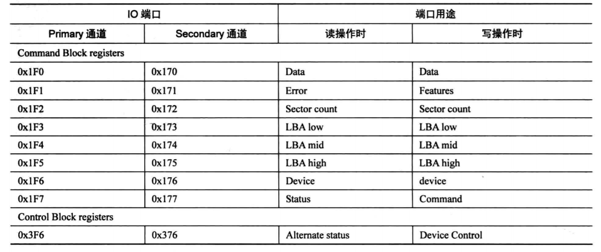

## 简介

- 代码任务:
    - 实模式下，使用一个汇编调用另外一个汇编文件。
- 代码要求：
    1. 使用头文件的方式来确定常数
    2. 在汇编中读硬盘（hda）,读取另外一个文件
    3. 将控制权移交给另外一个文件
- 项目结构说明：有两个汇编文件，分别为mbr.s与loader.s，代表主引导记录（mbr），与引导程序（loader）一个头文件里面是loader的相关常数。通过`make run`与`make clean`运行.`make debug`来调试.
- 代码结果说明：mbr与loader分别做了一些输出
---

代码知识点分析：
1. 汇编文件一般末尾的格式为.s/.S/.asm 其中大小写s是有区别的，s不会做预处理也就是没法include
2. include与c/c++ ，是宏的替换而不是变量
3. vstart作用是向编译器指定起始地址
4. fs,gs寄存器是386加入的。没有特定的含义，据说是cs，ds，es后按照顺序命名的。
5. 读取磁盘的方法暂时不说
6. 用主引导记录调用loader的原因是，mbr可能因为空间不够用（510字节）,没办法把内核读入进来

7. 硬盘的相关端口如下

8. 表中各个寄存器的功能。
```
　　data寄存器顾名思义就是管理数据的，数据的读写当然是越快越好，所以data寄存器比其他寄存器宽一些，16位。在读硬盘时，硬盘准备好数据后，硬盘控制器将其放在内部的缓存区中，不断读此寄存器便是读出缓存器中的全部数据。在写硬盘时，我们要把数据不断写入此寄存器中，然后数据便会被送入缓存区，硬盘控制器发现这个缓存区中有数据了，便将此处数据写入相应扇区中。

　　读硬盘时0x171或0x1F1的寄存器叫做Error寄存器，只在读取失败时才有用，里面有记录失败的信息，尚未读取的扇区数在Sector count寄存器中。在写硬盘时，该寄存器叫做Feature寄存器，里面是一些命令需要指定的额外参数。Error和Feature是同一个寄存器，只是在不同情况有不同的名称，它是八位寄存器。

　　Sector count寄存器用来指定带读取或者带写入的扇区数。硬盘每完成一个扇区，此寄存器中的值就会减一，这是一个八位寄存器，最大值为255，若指定为0，则表示需要操作256个扇区。

　　LBA寄存器有LBA low,LBA mid,LBA high三个，它们三个都是8位，LBA  low寄存器用来存储28位地址的第0~7位，LBA mid用来存储28位的第8~15位，LBA high寄存器用来存储28位的第16~23位。那么剩下的四位呢？ 这就是device寄存器的任务了。

　　device寄存器是个杂项，它的宽度是八位，第四位是存储LBA的第24位~27位。结合上面的三个LBA寄存器，第四位用来指定通道上的主盘或从盘，0代表从，1代表主。第六位用来存储是否启用LBA方式，1代表LBA模式，0代表CHS模式。另外两位第五位和第七位是固定为1的，称为MBS位，可以不用注意。

　　读硬盘时，端口0x1F7或0x177的寄存器叫Status，它是8位宽度的寄存器，用来给出硬盘的状态信息。第0位是ERR位，如果此位为1，表示命令出错了，具体原因可见Error寄存器。第三位data request位，如果此位为1，表示数据已经准备好了。第6位为DRDY，表示硬盘就绪。第七位是BSY位，表示硬盘是否繁忙。

　　写硬盘时，端口0x1F7或0x177的寄存器叫Command，它和Status是同一个，此寄存器用来存储让硬盘执行的命令，把命令写入此寄存器，只要把命令写入此寄存器，硬盘就开始工作了。主要是以下三个命令：

　　　　1）identify : 0xEC    硬盘识别

　　　　2）read sector : 0x20   即读扇区

　　　　3) write sector : 0x30   即写扇区
```
9. 每次读入后都检测状态
---

参考资料：

1. 硬盘的基本知识概念

2. chs与lba格式

3. [自制操作系统Antz](http://www.cnblogs.com/LexMoon/p/antz04.htm)